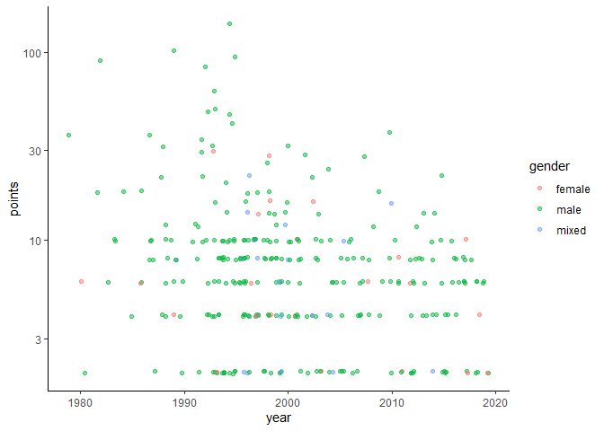
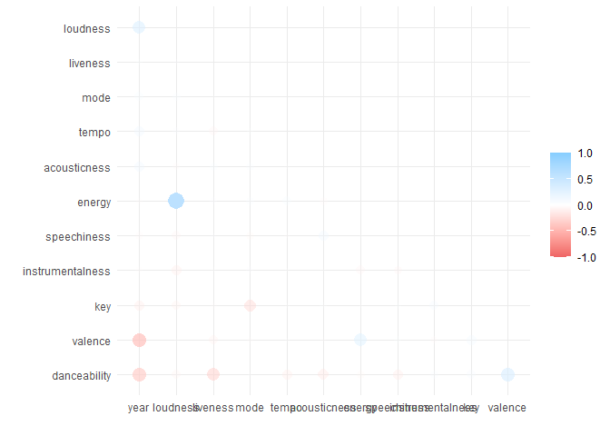
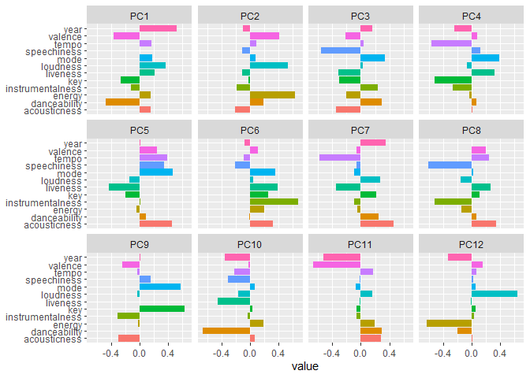
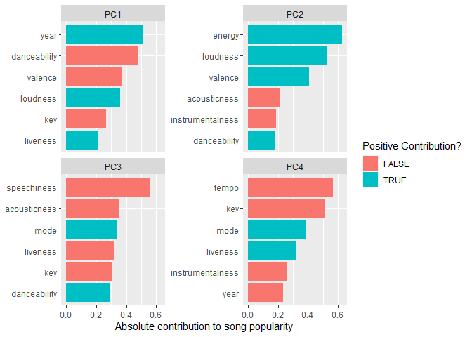
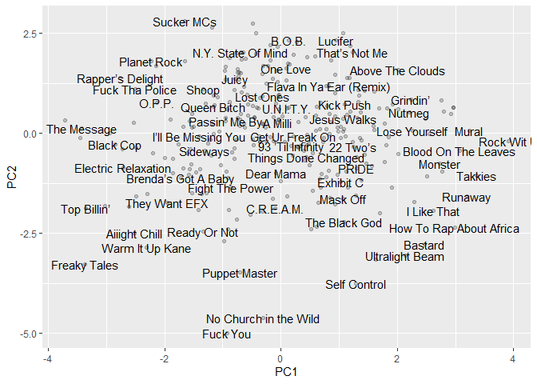

PCA Analysis of Hip Hop Songs
================
eNVy
2021-03-04

Building a model using *tidyverse* and *tidymodels* with the use of
Principal Component Analysis (PCA). Main goals are to understand the

-   Song characteristics
-   Critic Scores associated with the songs

------------------------------------------------------------------------

The procedure will use;

-   little bit of purrr
-   little bit of spotifyr
-   Major pre-processing
-   Major data handling
-   mild recipes

------------------------------------------------------------------------

## Explore the Data

``` r
# We'll be only using rankings data set.
rankings <- read_csv("https://raw.githubusercontent.com/rfordatascience/tidytuesday/master/data/2020/2020-04-14/rankings.csv") 

rankings %>% glimpse()
```

    ## Rows: 311
    ## Columns: 12
    ## $ ID     <dbl> 1, 2, 3, 4, 5, 6, 7, 8, 9, 10, 11, 12, 13, 14, 15, 16, 17, 1...
    ## $ title  <chr> "Juicy", "Fight The Power", "Shook Ones (Part II)", "The Mes...
    ## $ artist <chr> "The Notorious B.I.G.", "Public Enemy", "Mobb Deep", "Grandm...
    ## $ year   <dbl> 1994, 1989, 1995, 1982, 1992, 1993, 1993, 1992, 1994, 1995, ...
    ## $ gender <chr> "male", "male", "male", "male", "male", "male", "male", "mal...
    ## $ points <dbl> 140, 100, 94, 90, 84, 62, 50, 48, 46, 42, 38, 36, 36, 34, 32...
    ## $ n      <dbl> 18, 11, 13, 14, 14, 10, 7, 6, 7, 6, 5, 5, 4, 6, 5, 5, 4, 5, ...
    ## $ n1     <dbl> 9, 7, 4, 5, 2, 3, 2, 3, 1, 2, 2, 1, 2, 1, 1, 0, 2, 2, 1, 1, ...
    ## $ n2     <dbl> 3, 3, 5, 3, 4, 1, 2, 2, 3, 1, 0, 1, 2, 0, 1, 3, 1, 0, 1, 1, ...
    ## $ n3     <dbl> 3, 1, 1, 1, 2, 1, 2, 0, 1, 1, 3, 3, 0, 2, 2, 1, 0, 1, 1, 1, ...
    ## $ n4     <dbl> 1, 0, 1, 0, 4, 4, 0, 0, 1, 2, 0, 0, 0, 3, 0, 0, 1, 0, 1, 0, ...
    ## $ n5     <dbl> 2, 0, 2, 5, 2, 1, 1, 1, 1, 0, 0, 0, 0, 0, 1, 1, 0, 2, 1, 2, ...

``` r
rankings %>% ggplot(mapping = aes(year, points , color = gender)) + 
  geom_jitter( alpha = 0.5, ) + 
  scale_y_log10() + 
  theme_classic()
```

<!-- --> Notice
the linear distribution of data between 1 \~ 20 of points.

``` r
# after obtainig the spotify access tokens from whatever developer account
# we can pull audio features from a created playlist
id <- '3bfec784c0c547ba8faf7e3af769277e'
secret <-  'b25faee713f84d03b56e09d0bc1bb5fd'
access_tokens <- get_spotify_access_token(client_id = id,client_secret = secret)
playlist <-  get_playlist_audio_features("tmock1923", "7esD007S7kzeSwVtcH9GFe", authorization = access_tokens)

playlist %>% head()
```

    ## # A tibble: 6 x 61
    ##   playlist_id playlist_name playlist_img playlist_owner_~ playlist_owner_~
    ##   <chr>       <chr>         <chr>        <chr>            <chr>           
    ## 1 7esD007S7k~ Top 250 Hiph~ https://mos~ tmock1923        tmock1923       
    ## 2 7esD007S7k~ Top 250 Hiph~ https://mos~ tmock1923        tmock1923       
    ## 3 7esD007S7k~ Top 250 Hiph~ https://mos~ tmock1923        tmock1923       
    ## 4 7esD007S7k~ Top 250 Hiph~ https://mos~ tmock1923        tmock1923       
    ## 5 7esD007S7k~ Top 250 Hiph~ https://mos~ tmock1923        tmock1923       
    ## 6 7esD007S7k~ Top 250 Hiph~ https://mos~ tmock1923        tmock1923       
    ## # ... with 56 more variables: danceability <dbl>, energy <dbl>, key <int>,
    ## #   loudness <dbl>, mode <int>, speechiness <dbl>, acousticness <dbl>,
    ## #   instrumentalness <dbl>, liveness <dbl>, valence <dbl>, tempo <dbl>,
    ## #   track.id <chr>, analysis_url <chr>, time_signature <int>, added_at <chr>,
    ## #   is_local <lgl>, primary_color <lgl>, added_by.href <chr>,
    ## #   added_by.id <chr>, added_by.type <chr>, added_by.uri <chr>,
    ## #   added_by.external_urls.spotify <chr>, track.artists <list>,
    ## #   track.available_markets <list>, track.disc_number <int>,
    ## #   track.duration_ms <int>, track.episode <lgl>, track.explicit <lgl>,
    ## #   track.href <chr>, track.is_local <lgl>, track.name <chr>,
    ## #   track.popularity <int>, track.preview_url <chr>, track.track <lgl>,
    ## #   track.track_number <int>, track.type <chr>, track.uri <chr>,
    ## #   track.album.album_type <chr>, track.album.artists <list>,
    ## #   track.album.available_markets <list>, track.album.href <chr>,
    ## #   track.album.id <chr>, track.album.images <list>, track.album.name <chr>,
    ## #   track.album.release_date <chr>, track.album.release_date_precision <chr>,
    ## #   track.album.total_tracks <int>, track.album.type <chr>,
    ## #   track.album.uri <chr>, track.album.external_urls.spotify <chr>,
    ## #   track.external_ids.isrc <chr>, track.external_urls.spotify <chr>,
    ## #   video_thumbnail.url <lgl>, key_name <chr>, mode_name <chr>, key_mode <chr>

``` r
playlist %>% count(time_signature) 
```

    ## # A tibble: 4 x 2
    ##   time_signature     n
    ## *          <int> <int>
    ## 1              1     1
    ## 2              3     3
    ## 3              4   245
    ## 4              5     1

``` r
playlist %>% 
  filter(time_signature == 3) %>% 
  pull(track.name)
```

    ## [1] "Ready or Not"                 "Cannon (AMG Remix)"          
    ## [3] "HYFR (Hell Ya Fucking Right)"

``` r
pull_id <- function(query) {
  search_spotify(query, authorization = access_tokens, "track") %>% 
    arrange(-popularity) %>% 
    filter(row_number() == 1) %>%
    pull(id)
}


rankings %>% head(3) %>% 
  mutate(sQuery = paste(title, artist), 
         sQuery = str_to_lower(sQuery)) %>% 
  mutate(id =  map_chr(sQuery, pull_id))  %>% select(title, artist, id)
```

    ## # A tibble: 3 x 3
    ##   title                artist               id                    
    ##   <chr>                <chr>                <chr>                 
    ## 1 Juicy                The Notorious B.I.G. 5ByAIlEEnxYdvpnezg7HTX
    ## 2 Fight The Power      Public Enemy         1yo16b3u0lptm6Cs7lx4AD
    ## 3 Shook Ones (Part II) Mobb Deep            4nASzyRbzL5qZQuOPjQfsj

``` r
# the function fails when it pulls head(4)
# we can use possibly within purrr to identify where it goes wrong. 

rankings %>% head(5) %>% 
  mutate(sQuery = paste(title, artist), 
         sQuery = str_to_lower(sQuery)) %>% 
  mutate(id =  map_chr(sQuery, possibly(pull_id, NA_character_)))  %>% select(title, artist, id)
```

    ## # A tibble: 5 x 3
    ##   title                  artist                             id                  
    ##   <chr>                  <chr>                              <chr>               
    ## 1 Juicy                  The Notorious B.I.G.               5ByAIlEEnxYdvpnezg7~
    ## 2 Fight The Power        Public Enemy                       1yo16b3u0lptm6Cs7lx~
    ## 3 Shook Ones (Part II)   Mobb Deep                          4nASzyRbzL5qZQuOPjQ~
    ## 4 The Message            Grandmaster Flash & The Furious F~ 5DuTNKFEjJIySAyJH1y~
    ## 5 Nuthin’ But A ‘G’ Tha~ Dr Dre ft. Snoop Doggy Dogg        <NA>

``` r
# it fails when searching the artist with ft. with some other artists
# so we'll remove everything after "ft." and then search

rankingID <- rankings %>%  
  mutate(sQuery = paste(title, artist), 
         sQuery = str_to_lower(sQuery), 
         sQuery = str_remove(sQuery, "ft.*$")) %>% 
  mutate(id =  map_chr(sQuery, possibly(pull_id, NA_character_)))
```

For 5% percent of songs we can’t find an spotify id. But that fine

``` r
rankingFeatures <- rankingID %>% 
  mutate(idGroup  = row_number() %/% 80) %>% 
  select(idGroup, id) %>% 
  nest(data = c(id)) %>% 
  mutate(audioFeatures = map(data, ~get_track_audio_features(.$id, authorization = access_tokens)))
```

``` r
rankingDF <- rankingID %>% 
  bind_cols(rankingFeatures %>% 
              select(audioFeatures) %>% 
              unnest(audioFeatures)) %>% 
  select(title, artist, points, year, danceability:tempo) %>% 
  na.omit()

rankingDF %>% head()
```

    ## # A tibble: 6 x 15
    ##   title artist points  year danceability energy   key loudness  mode speechiness
    ##   <chr> <chr>   <dbl> <dbl>        <dbl>  <dbl> <int>    <dbl> <int>       <dbl>
    ## 1 Juicy The N~    140  1994        0.889  0.818     9    -4.64     1       0.253
    ## 2 Figh~ Publi~    100  1989        0.797  0.582     2   -13.0      1       0.255
    ## 3 Shoo~ Mobb ~     94  1995        0.637  0.878     6    -5.51     1       0.369
    ## 4 The ~ Grand~     90  1982        0.947  0.607    10   -10.6      0       0.202
    ## 5 Nuth~ Dr Dr~     84  1992        0.801  0.699    11    -8.18     0       0.279
    ## 6 C.R.~ Wu-Ta~     62  1993        0.479  0.549    11   -10.6      0       0.373
    ## # ... with 5 more variables: acousticness <dbl>, instrumentalness <dbl>,
    ## #   liveness <dbl>, valence <dbl>, tempo <dbl>

``` r
rankingDF %>% 
  select(year:tempo) %>% 
  correlate() %>% 
  rearrange() %>% 
  shave() %>% 
  rplot() + silgelib::theme_plex()
```

<!-- -->

``` r
rankingLM <- rankingDF %>% 
  select(-title, -artist) %>% 
  lm(log(points) ~. ,data = .)

summary(rankingLM)
```

    ## 
    ## Call:
    ## lm(formula = log(points) ~ ., data = .)
    ## 
    ## Residuals:
    ##      Min       1Q   Median       3Q      Max 
    ## -1.72027 -0.56296  0.05858  0.45598  2.64302 
    ## 
    ## Coefficients:
    ##                    Estimate Std. Error t value Pr(>|t|)    
    ## (Intercept)      72.6312308 13.9215839   5.217 3.52e-07 ***
    ## year             -0.0350643  0.0068406  -5.126 5.50e-07 ***
    ## danceability     -0.0153583  0.4147598  -0.037   0.9705    
    ## energy           -0.1228790  0.4345637  -0.283   0.7776    
    ## key               0.0099895  0.0135696   0.736   0.4622    
    ## loudness          0.0416113  0.0227767   1.827   0.0688 .  
    ## mode             -0.1061264  0.1025111  -1.035   0.3014    
    ## speechiness      -0.3110184  0.4051060  -0.768   0.4433    
    ## acousticness      0.4347702  0.3073889   1.414   0.1583    
    ## instrumentalness -0.4914704  0.8100397  -0.607   0.5445    
    ## liveness         -0.0136457  0.2612565  -0.052   0.9584    
    ## valence          -0.3904607  0.2852168  -1.369   0.1721    
    ## tempo             0.0009488  0.0016277   0.583   0.5604    
    ## ---
    ## Signif. codes:  0 '***' 0.001 '**' 0.01 '*' 0.05 '.' 0.1 ' ' 1
    ## 
    ## Residual standard error: 0.8207 on 283 degrees of freedom
    ## Multiple R-squared:  0.1051, Adjusted R-squared:  0.0672 
    ## F-statistic: 2.771 on 12 and 283 DF,  p-value: 0.00139

## Principal Component analysis

``` r
hiphop_recipe <- recipe(points ~ . , data = rankingDF) %>% 
  update_role(title, artist, new_role = "id") %>% 
  step_log(points) %>% 
  step_normalize(all_predictors()) %>% 
  step_pca(all_predictors()) 

hiphop_rec_prep <- prep(hiphop_recipe)
```

### Explore the results of PCA

``` r
tidy_pca <- yardstick::tidy(hiphop_rec_prep, 3)


tidy_pca %>% 
  mutate(component = fct_inorder(component)) %>% 
  ggplot(aes(x = value, y = terms, fill = terms)) + 
  geom_col(show.legend = FALSE) + 
  facet_wrap(~component) + 
  labs(y = NULL)
```

<!-- -->

``` r
tidy_pca %>% 
  filter(component %in% c("PC1", "PC2" , "PC3", "PC4")) %>% 
  group_by(component) %>% 
  top_n(6, abs(value)) %>% 
  ungroup() %>% 
  mutate(
    terms = tidytext::reorder_within(terms, abs(value), component)
  ) %>% 
  ggplot(aes(x = abs(value), y = terms, fill = value > 0)) + 
  geom_col() + 
  labs(x = "Absolute contribution to song popularity", y = NULL, fill = "Positive Contribution?") + 
  facet_wrap(~component, scales = "free_y") + 
  tidytext::scale_y_reordered()
```

<!-- -->

``` r
# fonts issue, might get stuck here. if so. load fonts loadfonts(win) or something
juice(hiphop_rec_prep) %>% 
  ggplot(aes(PC1, PC2, label = title))  + 
  geom_point(alpha = 0.2) + 
  geom_text(check_overlap = T, family = "Calibri Light")
```

<!-- -->

``` r
sdev = hiphop_rec_prep$steps[[3]]$res$sdev

percent_var = sdev ^ 2 / sum(sdev^2)

tibble(component = unique(tidy_pca$component), 
       percent_var = percent_var) %>% 
  mutate(
    component = fct_inorder(component)
  ) %>% 
  ggplot(aes(component, percent_var)) + 
  geom_col(show.legend = F, fill = "indianred4") + 
  scale_y_continuous(labels = scales::percent_format())
```

<!-- -->

``` r
pca_lm <- juice(hiphop_rec_prep) %>% 
  select(-title, -artist) %>% 
  lm(points ~., data = .)

summary(pca_lm)
```

    ## 
    ## Call:
    ## lm(formula = points ~ ., data = .)
    ## 
    ## Residuals:
    ##      Min       1Q   Median       3Q      Max 
    ## -1.61630 -0.58336  0.04982  0.39799  2.87825 
    ## 
    ## Coefficients:
    ##              Estimate Std. Error t value Pr(>|t|)    
    ## (Intercept)  1.925137   0.048847  39.411  < 2e-16 ***
    ## PC1         -0.089392   0.033916  -2.636  0.00885 ** 
    ## PC2          0.044885   0.037096   1.210  0.22728    
    ## PC3         -0.064388   0.042175  -1.527  0.12793    
    ## PC4          0.006494   0.045987   0.141  0.88781    
    ## PC5         -0.041949   0.046759  -0.897  0.37040    
    ## ---
    ## Signif. codes:  0 '***' 0.001 '**' 0.01 '*' 0.05 '.' 0.1 ' ' 1
    ## 
    ## Residual standard error: 0.8404 on 290 degrees of freedom
    ## Multiple R-squared:  0.03835,    Adjusted R-squared:  0.02177 
    ## F-statistic: 2.313 on 5 and 290 DF,  p-value: 0.044

## Conclusion

**The model is LAAAMMMEEEE**

------------------------------------------------------------------------
