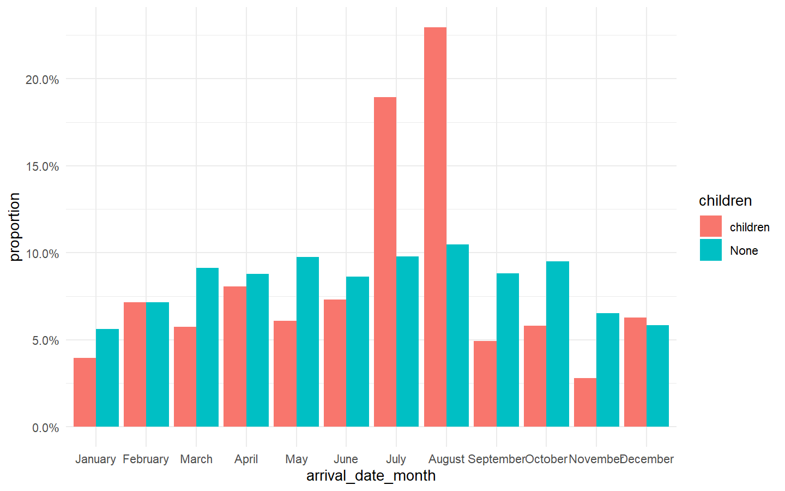
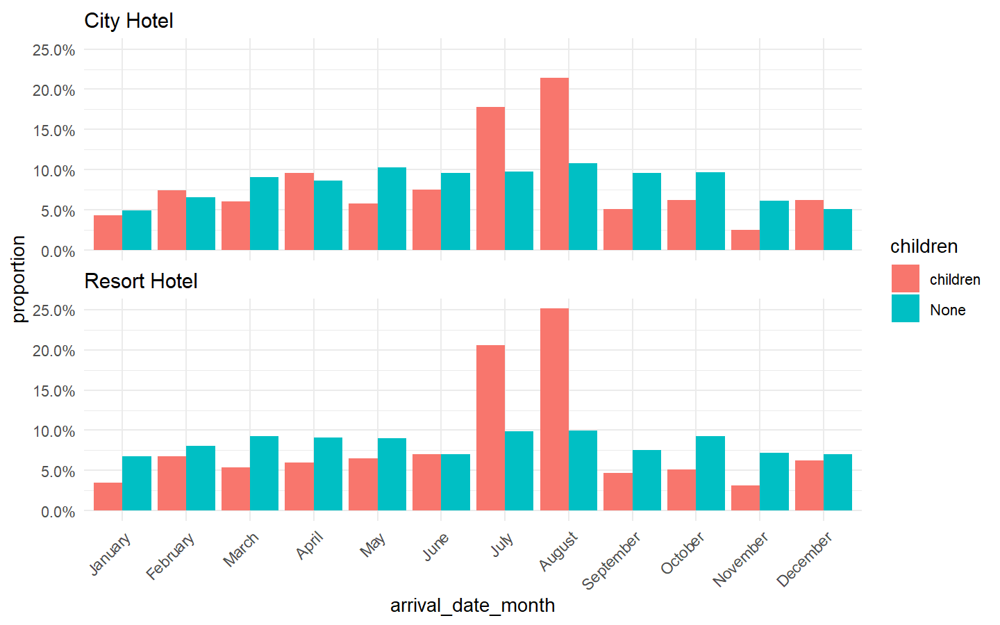
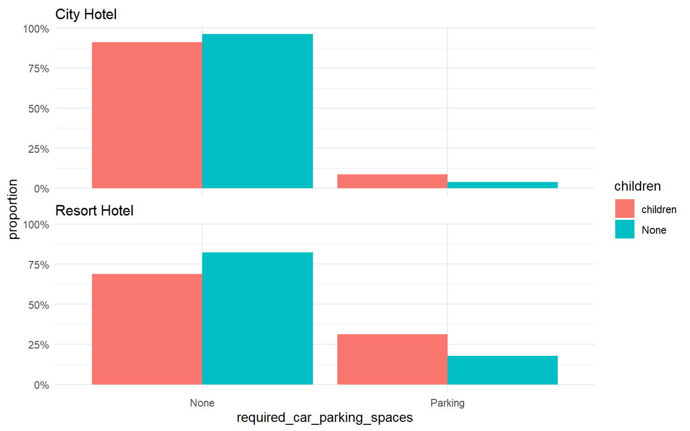
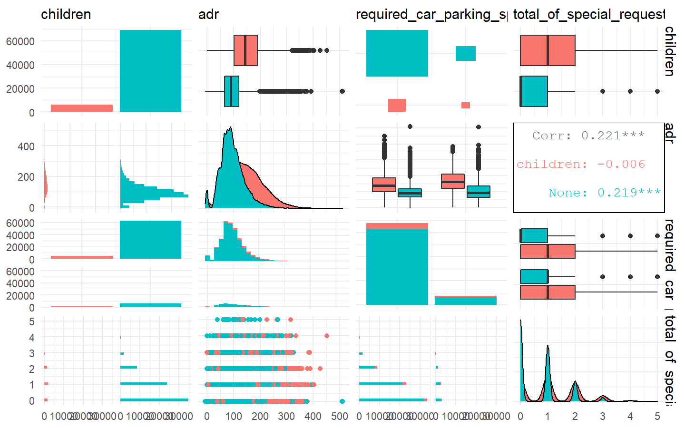
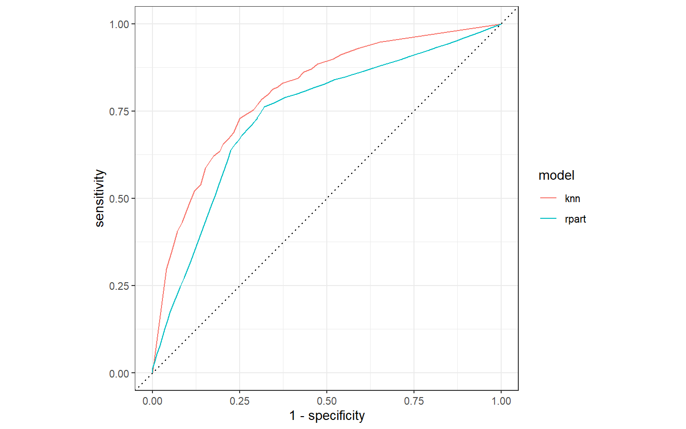
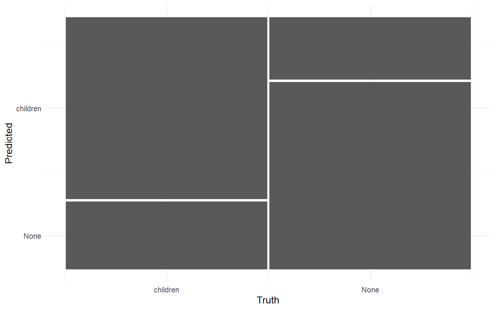

Hotel Booking - tidymodels and recipe
================
eNVy
2020-11-10

    ## -- Attaching packages --------------------------------------- tidyverse 1.3.0 --

    ## v ggplot2 3.3.2     v purrr   0.3.4
    ## v tibble  3.0.4     v dplyr   1.0.2
    ## v tidyr   1.1.2     v stringr 1.4.0
    ## v readr   1.3.1     v forcats 0.5.0

    ## -- Conflicts ------------------------------------------ tidyverse_conflicts() --
    ## x dplyr::filter() masks stats::filter()
    ## x dplyr::lag()    masks stats::lag()

    ## -- Attaching packages -------------------------------------- tidymodels 0.1.1 --

    ## v broom     0.7.0      v recipes   0.1.13
    ## v dials     0.0.9      v rsample   0.0.8 
    ## v infer     0.5.3      v tune      0.1.1 
    ## v modeldata 0.1.0      v workflows 0.2.1 
    ## v parsnip   0.1.4      v yardstick 0.0.7

    ## -- Conflicts ----------------------------------------- tidymodels_conflicts() --
    ## x scales::discard() masks purrr::discard()
    ## x dplyr::filter()   masks stats::filter()
    ## x recipes::fixed()  masks stringr::fixed()
    ## x dplyr::lag()      masks stats::lag()
    ## x yardstick::spec() masks readr::spec()
    ## x recipes::step()   masks stats::step()

Let’s build a model using recipes for [hotel bookings from February 11th
\#tidytuesday \#rstats
data](https://github.com/shakkyaNV/tidytuesday/tree/master/data/2020/2020-02-11/readme.md)

## Explore the Data

``` r
hotels <- readr::read_csv("https://raw.githubusercontent.com/rfordatascience/tidytuesday/master/data/2020/2020-02-11/hotels.csv")

hotels %>% count(is_canceled)
```

    ## # A tibble: 2 x 2
    ##   is_canceled     n
    ##         <dbl> <int>
    ## 1           0 75166
    ## 2           1 44224

The data is very interesting and the distributions of the data is highly
different based on if the reservation is canceled or not.  
Hence we will simply the question to form a model for people who did not
cancel their reservation.

``` r
set.seed(124)
hotels %>% select(children, babies) %>% sample_n(10)
```

    ## # A tibble: 10 x 2
    ##    children babies
    ##       <dbl>  <dbl>
    ##  1        0      0
    ##  2        0      0
    ##  3        0      0
    ##  4        0      0
    ##  5        0      0
    ##  6        2      0
    ##  7        0      0
    ##  8        0      0
    ##  9        0      0
    ## 10        0      0

We will build a predictive model to predict if the people stayed, stayed
with children or not. But the data is highly imbalanced based on
`children` variable as you can see by the following tibble.

``` r
hotels %>% drop_na() %>% count(children != 0 )
```

    ## # A tibble: 2 x 2
    ##   `children != 0`      n
    ##   <lgl>            <int>
    ## 1 FALSE           110796
    ## 2 TRUE              8590

``` r
hotel_stays <- hotels %>% 
  filter(is_canceled == 0) %>% 
  mutate(children = case_when(children + babies > 0 ~ "children", 
         TRUE ~ "None"),
         required_car_parking_spaces = case_when(required_car_parking_spaces > 0 ~ "Parking", TRUE ~ "None")) %>% 
  select(-is_canceled, -reservation_status, -babies)

hotel_stays %>%
  count(children)
```

    ## # A tibble: 2 x 2
    ##   children     n
    ##   <chr>    <int>
    ## 1 children  6073
    ## 2 None     69093

``` r
library(skimr)
skim(hotel_stays)
```

|                                                  |              |
| :----------------------------------------------- | :----------- |
| Name                                             | hotel\_stays |
| Number of rows                                   | 75166        |
| Number of columns                                | 29           |
| \_\_\_\_\_\_\_\_\_\_\_\_\_\_\_\_\_\_\_\_\_\_\_   |              |
| Column type frequency:                           |              |
| character                                        | 14           |
| Date                                             | 1            |
| numeric                                          | 14           |
| \_\_\_\_\_\_\_\_\_\_\_\_\_\_\_\_\_\_\_\_\_\_\_\_ |              |
| Group variables                                  | None         |

Data summary

**Variable type: character**

| skim\_variable                 | n\_missing | complete\_rate | min | max | empty | n\_unique | whitespace |
| :----------------------------- | ---------: | -------------: | --: | --: | ----: | --------: | ---------: |
| hotel                          |          0 |              1 |  10 |  12 |     0 |         2 |          0 |
| arrival\_date\_month           |          0 |              1 |   3 |   9 |     0 |        12 |          0 |
| children                       |          0 |              1 |   4 |   8 |     0 |         2 |          0 |
| meal                           |          0 |              1 |   2 |   9 |     0 |         5 |          0 |
| country                        |          0 |              1 |   2 |   4 |     0 |       166 |          0 |
| market\_segment                |          0 |              1 |   6 |  13 |     0 |         7 |          0 |
| distribution\_channel          |          0 |              1 |   3 |   9 |     0 |         5 |          0 |
| reserved\_room\_type           |          0 |              1 |   1 |   1 |     0 |         9 |          0 |
| assigned\_room\_type           |          0 |              1 |   1 |   1 |     0 |        10 |          0 |
| deposit\_type                  |          0 |              1 |  10 |  10 |     0 |         3 |          0 |
| agent                          |          0 |              1 |   1 |   4 |     0 |       315 |          0 |
| company                        |          0 |              1 |   1 |   4 |     0 |       332 |          0 |
| customer\_type                 |          0 |              1 |   5 |  15 |     0 |         4 |          0 |
| required\_car\_parking\_spaces |          0 |              1 |   4 |   7 |     0 |         2 |          0 |

**Variable type: Date**

| skim\_variable            | n\_missing | complete\_rate | min        | max        | median     | n\_unique |
| :------------------------ | ---------: | -------------: | :--------- | :--------- | :--------- | --------: |
| reservation\_status\_date |          0 |              1 | 2015-07-01 | 2017-09-14 | 2016-09-01 |       805 |

**Variable type: numeric**

| skim\_variable                    | n\_missing | complete\_rate |    mean |    sd |      p0 |    p25 |    p50 |  p75 | p100 | hist  |
| :-------------------------------- | ---------: | -------------: | ------: | ----: | ------: | -----: | -----: | ---: | ---: | :---- |
| lead\_time                        |          0 |              1 |   79.98 | 91.11 |    0.00 |    9.0 |   45.0 |  124 |  737 | ▇▂▁▁▁ |
| arrival\_date\_year               |          0 |              1 | 2016.15 |  0.70 | 2015.00 | 2016.0 | 2016.0 | 2017 | 2017 | ▃▁▇▁▆ |
| arrival\_date\_week\_number       |          0 |              1 |   27.08 | 13.90 |    1.00 |   16.0 |   28.0 |   38 |   53 | ▆▇▇▇▆ |
| arrival\_date\_day\_of\_month     |          0 |              1 |   15.84 |  8.78 |    1.00 |    8.0 |   16.0 |   23 |   31 | ▇▇▇▇▆ |
| stays\_in\_weekend\_nights        |          0 |              1 |    0.93 |  0.99 |    0.00 |    0.0 |    1.0 |    2 |   19 | ▇▁▁▁▁ |
| stays\_in\_week\_nights           |          0 |              1 |    2.46 |  1.92 |    0.00 |    1.0 |    2.0 |    3 |   50 | ▇▁▁▁▁ |
| adults                            |          0 |              1 |    1.83 |  0.51 |    0.00 |    2.0 |    2.0 |    2 |    4 | ▁▂▇▁▁ |
| is\_repeated\_guest               |          0 |              1 |    0.04 |  0.20 |    0.00 |    0.0 |    0.0 |    0 |    1 | ▇▁▁▁▁ |
| previous\_cancellations           |          0 |              1 |    0.02 |  0.27 |    0.00 |    0.0 |    0.0 |    0 |   13 | ▇▁▁▁▁ |
| previous\_bookings\_not\_canceled |          0 |              1 |    0.20 |  1.81 |    0.00 |    0.0 |    0.0 |    0 |   72 | ▇▁▁▁▁ |
| booking\_changes                  |          0 |              1 |    0.29 |  0.74 |    0.00 |    0.0 |    0.0 |    0 |   21 | ▇▁▁▁▁ |
| days\_in\_waiting\_list           |          0 |              1 |    1.59 | 14.78 |    0.00 |    0.0 |    0.0 |    0 |  379 | ▇▁▁▁▁ |
| adr                               |          0 |              1 |   99.99 | 49.21 |  \-6.38 |   67.5 |   92.5 |  125 |  510 | ▇▆▁▁▁ |
| total\_of\_special\_requests      |          0 |              1 |    0.71 |  0.83 |    0.00 |    0.0 |    1.0 |    1 |    5 | ▇▁▁▁▁ |

As we can see there are too many unique items for variables such as
`agent, company`. We may want to lump them together to get a better
result.  
And most of the data e.g. `adr, adults` data are highly skewed and their
distribution is highly long tailed. Hence, the data requires heavy
pre-processing and some feature engineering as well.

### Exploratory Plots

``` r
hotel_stays %>% 
  mutate(arrival_date_month  = factor(arrival_date_month, levels = month.name)) %>% 
           count(arrival_date_month, children) %>%
  group_by(children) %>% 
  mutate(proportion = n/ sum(n)) %>%
  ggplot(aes(x = arrival_date_month, y = proportion, fill = children)) + 
  geom_col(position = "dodge") + 
  scale_y_continuous(labels = scales::percent_format())
```

<!-- -->

``` r
hotel_stays %>%
  count(hotel)
```

    ## # A tibble: 2 x 2
    ##   hotel            n
    ##   <chr>        <int>
    ## 1 City Hotel   46228
    ## 2 Resort Hotel 28938

Let’s see if the distribution of each hotel is different

``` r
hotel_stays %>% 
  mutate(arrival_date_month  = factor(arrival_date_month, levels = month.name)) %>% 
           count(hotel, arrival_date_month, children) %>%
  group_by(hotel, children) %>% 
  mutate(proportion = n/ sum(n)) %>% 
  ggplot(aes(x = arrival_date_month , y = proportion, fill = children)) + 
  geom_col(position = "dodge") + 
  scale_y_continuous(labels = scales::percent_format()) + 
  facet_wrap(~hotel, nrow = 2) + 
  theme(axis.text.x = element_text(angle = 45, hjust= 1))
```

<!-- -->

``` r
hotel_stays %>% 
           count(hotel, required_car_parking_spaces, children) %>%
  group_by(hotel, children) %>% 
  mutate(proportion = n/ sum(n)) %>% 
  ggplot(aes(x = required_car_parking_spaces , y = proportion, fill = children)) + 
  geom_col(position = "dodge") + 
  scale_y_continuous(labels = scales::percent_format()) + 
  facet_wrap(~hotel, nrow = 2)
```

<!-- -->

People who asked for parking are more likely to have children and
converse is true for people without children.

``` r
library(GGally)

hotel_stays %>% 
  select(children, adr, required_car_parking_spaces, 
         total_of_special_requests) %>% 
  ggpairs(mapping = aes(color = children))
```

<!-- -->

## Build a model with recipes and tidymodels

``` r
hotel_df <- hotel_stays %>% 
  select(children, hotel, arrival_date_month,
         meal, adr, adults, 
         required_car_parking_spaces, total_of_special_requests,
         stays_in_week_nights, stays_in_weekend_nights) %>% 
  mutate_if(is.character, factor) %>%  
  glimpse(width = 80)
```

    ## Rows: 75,166
    ## Columns: 10
    ## $ children                    <fct> None, None, None, None, None, None, Non...
    ## $ hotel                       <fct> Resort Hotel, Resort Hotel, Resort Hote...
    ## $ arrival_date_month          <fct> July, July, July, July, July, July, Jul...
    ## $ meal                        <fct> BB, BB, BB, BB, BB, BB, BB, FB, HB, BB,...
    ## $ adr                         <dbl> 0.00, 0.00, 75.00, 75.00, 98.00, 98.00,...
    ## $ adults                      <dbl> 2, 2, 1, 1, 2, 2, 2, 2, 2, 2, 2, 2, 2, ...
    ## $ required_car_parking_spaces <fct> None, None, None, None, None, None, Non...
    ## $ total_of_special_requests   <dbl> 0, 0, 0, 0, 1, 1, 0, 1, 0, 3, 1, 0, 3, ...
    ## $ stays_in_week_nights        <dbl> 0, 0, 1, 1, 2, 2, 2, 2, 4, 4, 4, 4, 4, ...
    ## $ stays_in_weekend_nights     <dbl> 0, 0, 0, 0, 0, 0, 0, 0, 0, 0, 0, 0, 0, ...

``` r
set.seed(1234)

split <- initial_split(hotel_df)
hotel_train <-  training(split)
hotel_test  <-  testing(split)


# build a recipe (same as pipe in py)

hotel_recipe <- hotel_train %>% recipe(children ~.) %>% # we're predicting children variable using all other data
  step_downsample(children) %>%
  step_dummy(all_nominal(), -all_outcomes()) %>%  # one hot encoding, but not for the outcome 
  step_nzv(all_numeric()) %>% # remove any variables with zero variance
  step_normalize(all_numeric()) %>% 
  prep()  # w/o prep we will only do collect the necessary steps 
# but prep() actually goes to our data and no the said steps to the data

hotel_recipe 
```

    ## Data Recipe
    ## 
    ## Inputs:
    ## 
    ##       role #variables
    ##    outcome          1
    ##  predictor          9
    ## 
    ## Training data contained 56375 data points and no missing data.
    ## 
    ## Operations:
    ## 
    ## Down-sampling based on children [trained]
    ## Dummy variables from hotel, arrival_date_month, ... [trained]
    ## Sparse, unbalanced variable filter removed 4 items [trained]
    ## Centering and scaling for adr, adults, ... [trained]

``` r
juice(hotel_recipe) # to get the processed training data out of the recipe 
```

    ## # A tibble: 9,176 x 19
    ##       adr adults total_of_specia~ stays_in_week_n~ stays_in_weeken~ children
    ##     <dbl>  <dbl>            <dbl>            <dbl>            <dbl> <fct>   
    ##  1  0.523  0.232            0.107            0.792          -0.997  children
    ##  2  0.495  0.232           -0.974           -0.290          -0.997  children
    ##  3 -0.369  0.232            1.19             1.33            1.05   children
    ##  4 -0.414 -1.82             1.19             0.792           1.05   children
    ##  5 -0.779  0.232            1.19             1.33            1.05   children
    ##  6  0.269  0.232            1.19             1.33            1.05   children
    ##  7  0.430  0.232            0.107            1.87            3.11   children
    ##  8  0.675  0.232            0.107            1.33            1.05   children
    ##  9  0.848  0.232            0.107            1.33            3.11   children
    ## 10  0.720  0.232           -0.974            0.792           0.0286 children
    ## # ... with 9,166 more rows, and 13 more variables: hotel_Resort.Hotel <dbl>,
    ## #   arrival_date_month_August <dbl>, arrival_date_month_December <dbl>,
    ## #   arrival_date_month_February <dbl>, arrival_date_month_July <dbl>,
    ## #   arrival_date_month_June <dbl>, arrival_date_month_March <dbl>,
    ## #   arrival_date_month_May <dbl>, arrival_date_month_October <dbl>,
    ## #   arrival_date_month_September <dbl>, meal_HB <dbl>, meal_SC <dbl>,
    ## #   required_car_parking_spaces_Parking <dbl>

``` r
# can do the same process via (bake(new_data = hotel_train), but the down sample won't work)
```

``` r
test_processed <- bake(hotel_recipe, new_data = hotel_test) %>% 
  glimpse(width = 80)
```

    ## Rows: 18,791
    ## Columns: 19
    ## $ adr                                 <dbl> -0.390086929, -0.309663303, 0.4...
    ## $ adults                              <dbl> 0.2323902, 0.2323902, 0.2323902...
    ## $ total_of_special_requests           <dbl> 0.1068525, 0.1068525, 0.1068525...
    ## $ stays_in_week_nights                <dbl> -0.2903545, -0.2903545, 0.79203...
    ## $ stays_in_weekend_nights             <dbl> -0.99709120, -0.99709120, -0.99...
    ## $ children                            <fct> None, None, None, None, None, N...
    ## $ hotel_Resort.Hotel                  <dbl> 1.233453, 1.233453, 1.233453, 1...
    ## $ arrival_date_month_August           <dbl> -0.4516849, -0.4516849, -0.4516...
    ## $ arrival_date_month_December         <dbl> -0.2611732, -0.2611732, -0.2611...
    ## $ arrival_date_month_February         <dbl> -0.2733434, -0.2733434, -0.2733...
    ## $ arrival_date_month_July             <dbl> 2.451383, 2.451383, 2.451383, 2...
    ## $ arrival_date_month_June             <dbl> -0.2989788, -0.2989788, -0.2989...
    ## $ arrival_date_month_March            <dbl> -0.2801888, -0.2801888, -0.2801...
    ## $ arrival_date_month_May              <dbl> -0.2955048, -0.2955048, -0.2955...
    ## $ arrival_date_month_October          <dbl> -0.2928811, -0.2928811, -0.2928...
    ## $ arrival_date_month_September        <dbl> -0.2714971, -0.2714971, -0.2714...
    ## $ meal_HB                             <dbl> -0.3987575, -0.3987575, -0.3987...
    ## $ meal_SC                             <dbl> -0.2558962, -0.2558962, -0.2558...
    ## $ required_car_parking_spaces_Parking <dbl> -0.3958158, -0.3958158, -0.3958...

``` r
# to avoid data leakage we pipe the testing data
# through the same recipe
```

## Build models

``` r
knn_spec <- nearest_neighbor() %>% 
  set_engine("kknn") %>% 
  set_mode("classification")
knn_fit <- knn_spec %>%
  fit(children ~., 
      data = juice(hotel_recipe))
knn_fit
```

    ## parsnip model object
    ## 
    ## Fit time:  1.8s 
    ## 
    ## Call:
    ## kknn::train.kknn(formula = children ~ ., data = data, ks = min_rows(5,     data, 5))
    ## 
    ## Type of response variable: nominal
    ## Minimal misclassification: 0.2519616
    ## Best kernel: optimal
    ## Best k: 5

``` r
tree_spec <- decision_tree() %>% 
  set_engine("rpart") %>%
  set_mode("classification")

tree_fit <- tree_spec %>% 
  fit(children ~. ,
      data = juice(hotel_recipe))

tree_fit # information of the decision (nodes/ leafs/ and stem)
```

    ## parsnip model object
    ## 
    ## Fit time:  310ms 
    ## n= 9176 
    ## 
    ## node), split, n, loss, yval, (yprob)
    ##       * denotes terminal node
    ## 
    ##  1) root 9176 4588 children (0.5000000 0.5000000)  
    ##    2) adr>=-0.03405154 4059 1092 children (0.7309682 0.2690318) *
    ##    3) adr< -0.03405154 5117 1621 None (0.3167872 0.6832128)  
    ##      6) total_of_special_requests>=0.647359 944  416 children (0.5593220 0.4406780) *
    ##      7) total_of_special_requests< 0.647359 4173 1093 None (0.2619219 0.7380781)  
    ##       14) adults< -2.852103 80    9 children (0.8875000 0.1125000) *
    ##       15) adults>=-2.852103 4093 1022 None (0.2496946 0.7503054) *

## Evaluate Our Model

``` r
set.seed(345)

val_splits <- mc_cv(juice(hotel_recipe), prop = 0.9 , strata = children)
val_splits
```

    ## # Monte Carlo cross-validation (0.9/0.1) with 25 resamples  using stratification 
    ## # A tibble: 25 x 2
    ##    splits             id        
    ##    <list>             <chr>     
    ##  1 <split [8.3K/916]> Resample01
    ##  2 <split [8.3K/916]> Resample02
    ##  3 <split [8.3K/916]> Resample03
    ##  4 <split [8.3K/916]> Resample04
    ##  5 <split [8.3K/916]> Resample05
    ##  6 <split [8.3K/916]> Resample06
    ##  7 <split [8.3K/916]> Resample07
    ##  8 <split [8.3K/916]> Resample08
    ##  9 <split [8.3K/916]> Resample09
    ## 10 <split [8.3K/916]> Resample10
    ## # ... with 15 more rows

### K Nearest Neighbor Results and Evaluations

``` r
knn_res <- fit_resamples( children ~. , 
               knn_spec, 
               val_splits, 
               control = control_resamples(save_pred =  TRUE)
) 

knn_res %>% 
  collect_metrics()
```

    ## # A tibble: 2 x 5
    ##   .metric  .estimator  mean     n std_err
    ##   <chr>    <chr>      <dbl> <int>   <dbl>
    ## 1 accuracy binary     0.739    25 0.00195
    ## 2 roc_auc  binary     0.805    25 0.00238

The model is fit on 8.3K data and is evaluated on 916 examples. But here
`fit_resample` is not doing any tuning, its’ just evaluating on the said
model.

### Decision Tree Results and Evaluations

``` r
tree_res <- fit_resamples( 
               children ~. , 
               tree_spec, 
               val_splits, 
               control = control_resamples(save_pred =  TRUE)
) 

tree_res %>% 
  collect_metrics()
```

    ## # A tibble: 2 x 5
    ##   .metric  .estimator  mean     n std_err
    ##   <chr>    <chr>      <dbl> <int>   <dbl>
    ## 1 accuracy binary     0.721    25 0.00274
    ## 2 roc_auc  binary     0.739    25 0.00266

### Predictions of the KNN model

``` r
knn_res %>% 
  unnest(.predictions) %>% 
  mutate(model = "knn")  %>% 
  bind_rows(tree_res %>% 
              unnest(.predictions) %>% 
              mutate(model = "rpart")) %>% 
  group_by(model) %>% 
  roc_curve (children, .pred_children) %>% 
  autoplot()
```

<!-- -->

``` r
knn_res %>% 
  unnest(.predictions) %>% 
  conf_mat(children, .pred_class) %>%
  autoplot()
```

<!-- -->

### KNN Predictions

``` r
knn_fit %>% 
  predict(new_data = test_processed, 
          type = "prob") %>% 
  mutate(truth = hotel_test$children) %>% 
  roc_auc(truth, .pred_children)
```

    ## # A tibble: 1 x 3
    ##   .metric .estimator .estimate
    ##   <chr>   <chr>          <dbl>
    ## 1 roc_auc binary         0.794
