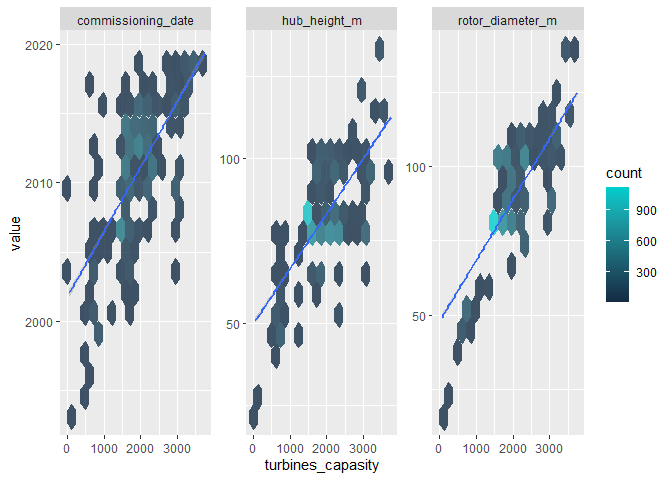
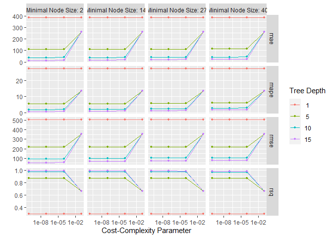
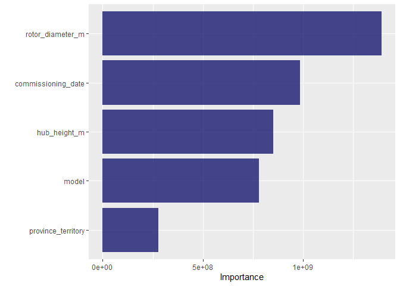
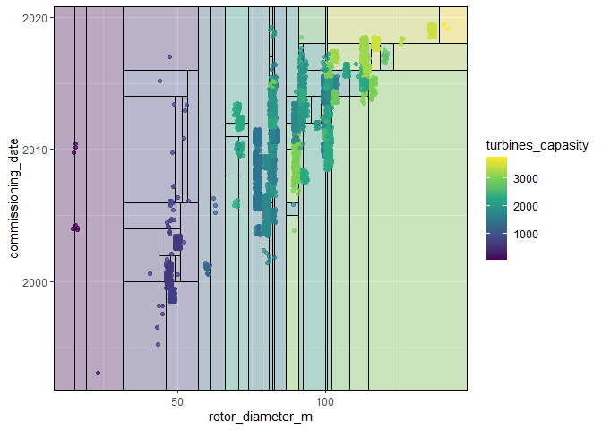
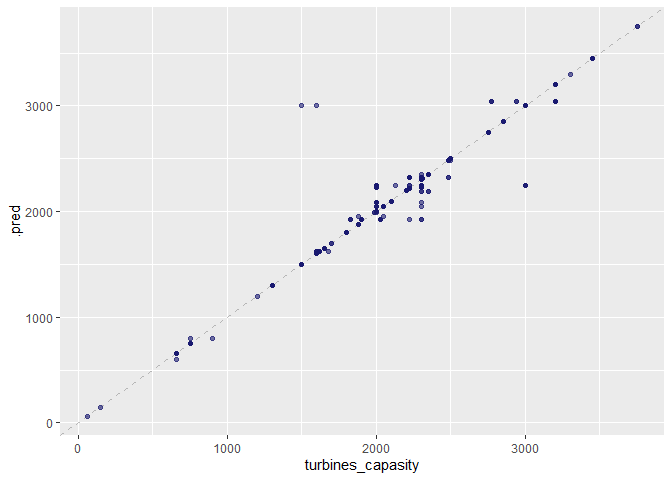

TidyTuesday - Canadian wind turbines
================
envy
11/5/2020

## Explore the data

``` r
library(knitr)
library(tidyverse)
```

    ## -- Attaching packages --------------------------------------- tidyverse 1.3.0 --

    ## v ggplot2 3.3.2     v purrr   0.3.4
    ## v tibble  3.0.4     v dplyr   1.0.2
    ## v tidyr   1.1.2     v stringr 1.4.0
    ## v readr   1.3.1     v forcats 0.5.0

    ## -- Conflicts ------------------------------------------ tidyverse_conflicts() --
    ## x dplyr::filter() masks stats::filter()
    ## x dplyr::lag()    masks stats::lag()

``` r
library(parttree)
library(rpart)
```

``` r
turbines <- read_csv('https://raw.githubusercontent.com/rfordatascience/tidytuesday/master/data/2020/2020-10-27/wind-turbine.csv')
```

    ## Parsed with column specification:
    ## cols(
    ##   objectid = col_double(),
    ##   province_territory = col_character(),
    ##   project_name = col_character(),
    ##   total_project_capacity_mw = col_double(),
    ##   turbine_identifier = col_character(),
    ##   turbine_number_in_project = col_character(),
    ##   turbine_rated_capacity_k_w = col_double(),
    ##   rotor_diameter_m = col_double(),
    ##   hub_height_m = col_double(),
    ##   manufacturer = col_character(),
    ##   model = col_character(),
    ##   commissioning_date = col_character(),
    ##   latitude = col_double(),
    ##   longitude = col_double(),
    ##   notes = col_character()
    ## )

``` r
turbines %>% count(commissioning_date, sort = TRUE)
```

    ## # A tibble: 35 x 2
    ##    commissioning_date     n
    ##    <chr>              <int>
    ##  1 2014                 873
    ##  2 2015                 635
    ##  3 2013                 621
    ##  4 2011                 590
    ##  5 2009                 485
    ##  6 2006                 455
    ##  7 2012                 404
    ##  8 2010                 334
    ##  9 2016                 266
    ## 10 2014/2015            207
    ## # ... with 25 more rows

``` r
t_df <-turbines %>%
  transmute(turbines_capasity = turbine_rated_capacity_k_w,
            rotor_diameter_m,
            hub_height_m, 
            commissioning_date = parse_number(commissioning_date), 
            province_territory = fct_lump(province_territory, 8), 
            model = fct_lump(model, 10)) %>% 
  filter(!is.na(turbines_capasity)) %>% 
  mutate_if(is.character, factor)
```

``` r
t_df %>% select(turbines_capasity:commissioning_date) %>% 
  pivot_longer(rotor_diameter_m:commissioning_date) %>% 
  ggplot(aes(x = turbines_capasity, y = value)) + 
  geom_hex(bins = 15, alpha =.8) + 
  geom_smooth(method = "lm") + 
  facet_wrap(~name, scales = "free_y") + 
  scale_fill_gradient(high = "cyan3")
```

    ## `geom_smooth()` using formula 'y ~ x'

<!-- -->

## Build a model

``` r
library(tidymodels)
```

    ## -- Attaching packages -------------------------------------- tidymodels 0.1.1 --

    ## v broom     0.7.0      v recipes   0.1.13
    ## v dials     0.0.9      v rsample   0.0.8 
    ## v infer     0.5.3      v tune      0.1.1 
    ## v modeldata 0.1.0      v workflows 0.2.1 
    ## v parsnip   0.1.4      v yardstick 0.0.7

    ## -- Conflicts ----------------------------------------- tidymodels_conflicts() --
    ## x scales::discard() masks purrr::discard()
    ## x dplyr::filter()   masks stats::filter()
    ## x recipes::fixed()  masks stringr::fixed()
    ## x dplyr::lag()      masks stats::lag()
    ## x dials::prune()    masks rpart::prune()
    ## x yardstick::spec() masks readr::spec()
    ## x recipes::step()   masks stats::step()

``` r
set.seed(123)
# data is split by quantiels by the conitniious vairables
wind_split <- initial_split(t_df, strata = turbines_capasity)
wind_train <- training(wind_split)
wind_test <- testing(wind_split)


set.seed(234)
wind_folds <-  vfold_cv(wind_train, strata = turbines_capasity)
wind_folds %>% head()
```

    ## # A tibble: 6 x 2
    ##   splits             id    
    ##   <list>             <chr> 
    ## 1 <split [4.4K/488]> Fold01
    ## 2 <split [4.4K/487]> Fold02
    ## 3 <split [4.4K/486]> Fold03
    ## 4 <split [4.4K/486]> Fold04
    ## 5 <split [4.4K/486]> Fold05
    ## 6 <split [4.4K/486]> Fold06

``` r
# specification mdodels
# Tree we'er going to model
tree_spec <- decision_tree(
  cost_complexity = tune(),
  tree_depth = tune(),
  min_n = tune()
) %>% 
  set_engine("rpart") %>% 
  set_mode("regression")
```

### regular grid

``` r
# set of parameters for the given model
tree_grid <- grid_regular(cost_complexity(), tree_depth(), min_n(), 
                          levels = 4)
```

``` r
doParallel::registerDoParallel()
set.seed(345)


tree_rs <- tune_grid(
  tree_spec,
  turbines_capasity ~.,
  resamples = wind_folds,
  grid  = tree_grid,
  metrics =  metric_set(rmse, rsq, mae, mape)
)  
```

## Explore results

``` r
collect_metrics(tree_rs)
```

    ## # A tibble: 256 x 9
    ##    cost_complexity tree_depth min_n .metric .estimator    mean     n std_err
    ##              <dbl>      <int> <int> <chr>   <chr>        <dbl> <int>   <dbl>
    ##  1    0.0000000001          1     2 mae     standard   386.       10  1.50  
    ##  2    0.0000000001          1     2 mape    standard    27.7      10  1.30  
    ##  3    0.0000000001          1     2 rmse    standard   508.       10  1.44  
    ##  4    0.0000000001          1     2 rsq     standard     0.303    10  0.0134
    ##  5    0.0000001             1     2 mae     standard   386.       10  1.50  
    ##  6    0.0000001             1     2 mape    standard    27.7      10  1.30  
    ##  7    0.0000001             1     2 rmse    standard   508.       10  1.44  
    ##  8    0.0000001             1     2 rsq     standard     0.303    10  0.0134
    ##  9    0.0001                1     2 mae     standard   386.       10  1.50  
    ## 10    0.0001                1     2 mape    standard    27.7      10  1.30  
    ## # ... with 246 more rows, and 1 more variable: .config <chr>

``` r
autoplot(tree_rs) + theme_gray()
```

<!-- -->

``` r
show_best(tree_rs, "mape")
```

    ## # A tibble: 5 x 9
    ##   cost_complexity tree_depth min_n .metric .estimator  mean     n std_err
    ##             <dbl>      <int> <int> <chr>   <chr>      <dbl> <int>   <dbl>
    ## 1    0.0000000001         15     2 mape    standard   0.564    10  0.0592
    ## 2    0.0000001            15     2 mape    standard   0.564    10  0.0591
    ## 3    0.0000000001         15    14 mape    standard   0.803    10  0.0541
    ## 4    0.0000001            15    14 mape    standard   0.803    10  0.0541
    ## 5    0.0001               15     2 mape    standard   0.890    10  0.0683
    ## # ... with 1 more variable: .config <chr>

``` r
final_tree <- finalize_model(tree_spec,select_best(tree_rs, "rmse"))
```

### Fitting

``` r
final_fit <- fit(final_tree, turbines_capasity ~., wind_train)
final_rs  <- last_fit(final_tree, turbines_capasity~., wind_split)
```

## Predicting on new data

``` r
predict(final_fit, wind_train[44,])
```

    ## # A tibble: 1 x 1
    ##   .pred
    ##   <dbl>
    ## 1   660

``` r
# predict(final_rs$.workflow[[1]], wind_train[144,])
```

## Visualize

``` r
library(vip)
```

    ## 
    ## Attaching package: 'vip'

    ## The following object is masked from 'package:utils':
    ## 
    ##     vi

``` r
final_fit %>% 
  vip(geom = "col", aesthetics = list(fill = "midnightblue", alpha = 0.8))
```

<!-- -->

``` r
example_fit <- fit(final_tree, turbines_capasity ~ rotor_diameter_m + commissioning_date, wind_train) 

wind_train %>% 
  ggplot(aes(rotor_diameter_m, commissioning_date)) + 
  geom_parttree(data = example_fit, aes(fill = turbines_capasity), alpha = 0.3) + 
  geom_jitter(alpha = 0.7, width  = 1, height = 0.5, aes(color  = turbines_capasity)) + 
  scale_colour_viridis_c(aesthetics = c("color", "fill"))
```

<!-- -->

``` r
collect_metrics(final_rs)
```

    ## # A tibble: 2 x 3
    ##   .metric .estimator .estimate
    ##   <chr>   <chr>          <dbl>
    ## 1 rmse    standard      73.6  
    ## 2 rsq     standard       0.985

``` r
collect_predictions(final_rs) %>% 
  ggplot(aes(turbines_capasity, .pred)) + # True on X axis, predicted on Y axis
  geom_abline(slope = 1, lty = 2, color = "gray50", alpha = 0.5) + 
  geom_point(alpha = 0.6, color = "midnightblue")
```

<!-- -->
